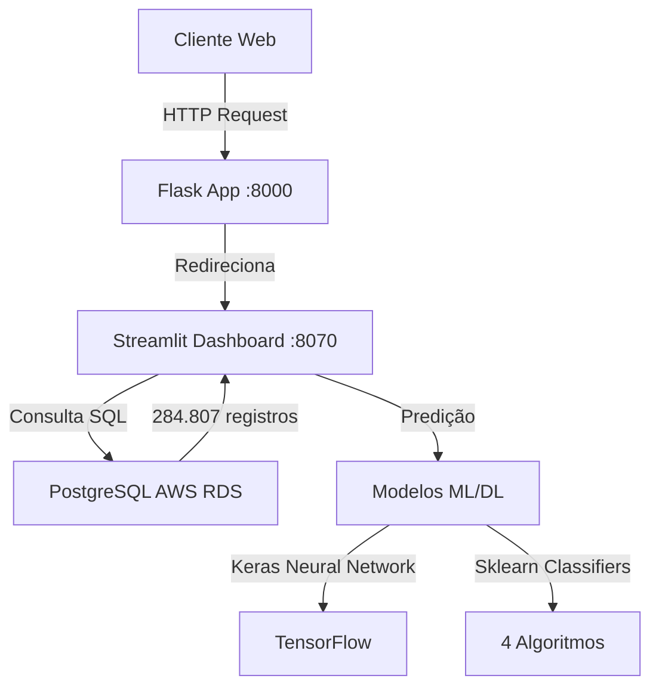

<div align="center">

# Tech Challenge F3 - Detecção de Fraudes em Cartões de Crédito


**Sistema completo de detecção de fraudes utilizando Machine Learning e Deep Learning**

[📺 Vídeo Demonstração](https://www.youtube.com/watch?v=k0QvrCU8xEg) • [🔗 Repositório](https://github.com/Wil-macedo/Tech-Challenge-F3)

</div>

---

## 📋 Índice

- [Sobre o Projeto](#-sobre-o-projeto)
- [Tecnologias Utilizadas](#-tecnologias-utilizadas)
- [Arquitetura do Sistema](#-arquitetura-do-sistema)
- [Dataset](#-dataset)
- [Modelos de Machine Learning](#-modelos-de-machine-learning)
- [Instalação](#-instalação)
- [Uso](#-uso)
- [Estrutura do Projeto](#-estrutura-do-projeto)
- [Pipeline de Dados](#-pipeline-de-dados)
- [Resultados](#-resultados)
- [Deploy](#-deploy)
- [Contribuindo](#-contribuindo)

---

## 🎯 Sobre o Projeto

Este projeto implementa um **sistema completo de detecção de fraudes em transações com cartões de crédito** utilizando técnicas avançadas de Machine Learning e Deep Learning. O sistema analisa padrões em transações financeiras para identificar comportamentos fraudulentos com alta precisão.

### Destaques

- ✅ **99.83%** de transações legítimas vs **0.17%** fraudes (dataset altamente desbalanceado)
- ✅ Múltiplos modelos de ML testados e comparados (Logistic Regression, KNN, SVM, Decision Tree, Neural Network)
- ✅ Dashboard interativo com visualizações em tempo real
- ✅ Pipeline completo de ETL e análise exploratória
- ✅ Deploy em produção (Azure App Service + AWS RDS)
- ✅ Técnicas avançadas de balanceamento (NearMiss, SMOTE)

---

## 🛠 Tecnologias Utilizadas

### Backend & Web Framework
- **Flask** - Servidor web REST API
- **Streamlit** - Dashboard interativo com visualizações

### Machine Learning & Data Science
- **TensorFlow/Keras** - Deep Learning para redes neurais
- **scikit-learn** - Algoritmos de classificação clássicos
- **pandas** - Manipulação e análise de dados
- **numpy** - Computação numérica
- **scipy** - Estatísticas científicas

### Visualização de Dados
- **matplotlib** - Gráficos estáticos
- **seaborn** - Visualizações estatísticas avançadas
- **Plotly** - Gráficos interativos

### Banco de Dados
- **PostgreSQL 12+** - AWS RDS (Produção)
- **psycopg2** - Driver Python para PostgreSQL

### DevOps & Deploy
- **Docker** - Containerização
- **Azure App Service** - Hospedagem da aplicação
- **AWS RDS** - Banco de dados gerenciado

---

## 🏗 Arquitetura do Sistema



### Componentes Principais

| Componente | Porta | Descrição |
|------------|-------|-----------|
| Flask Server | 8000 | API REST e roteamento principal |
| Streamlit Dashboard | 8070 | Interface visual e análises |
| PostgreSQL RDS | 5432 | Banco de dados AWS |

---

## 📊 Dataset

### Fonte
- **Origem**: [Kaggle - Credit Card Fraud Detection](https://www.kaggle.com/mlg-ulb/creditcardfraud)
- **Tamanho**: 284.807 transações
- **Features**: 30 variáveis (V1-V28 via PCA, Time, Amount)
- **Target**: Class (0 = Legítima, 1 = Fraude)

### Distribuição das Classes

| Classe | Quantidade | Percentual |
|--------|-----------|-----------|
| Legítimas (0) | 284.315 | 99.83% |
| Fraudes (1) | 492 | 0.17% |

**Desafio**: Dataset extremamente desbalanceado, exigindo técnicas especiais de tratamento.

---

## 🤖 Modelos de Machine Learning

### Modelos Implementados

| Modelo | ROC-AUC Score | Descrição |
|--------|--------------|-----------|
| **Keras Neural Network** | **Melhor** | Rede neural com 2 camadas ocultas |
| Logistic Regression | 0.97 | Classificador linear otimizado |
| Support Vector Classifier | 0.97 | Kernel RBF com GridSearchCV |
| K-Nearest Neighbors | 0.93 | KNN com k otimizado |
| Decision Tree | 0.91 | Árvore de decisão com poda |

### Pipeline de Machine Learning

```python
1. Pré-processamento
   ├── Normalização (RobustScaler)
   ├── Remoção de outliers (IQR)
   └── Feature Engineering

2. Balanceamento de Classes
   ├── NearMiss (Undersampling)
   └── SMOTE (Oversampling)

3. Treinamento e Validação
   ├── StratifiedKFold (5-fold)
   ├── GridSearchCV (hiperparâmetros)
   └── Cross-validation

4. Avaliação
   ├── ROC-AUC Curves
   ├── Precision-Recall
   ├── Confusion Matrix
   └── F1-Score, Recall, Precision
```

---

## 🚀 Instalação

### Pré-requisitos

- Python 3.8+
- pip (gerenciador de pacotes Python)
- PostgreSQL (opcional, para executar localmente)
- Docker (opcional)

### Passo a Passo

1. **Clone o repositório**
```bash
git clone https://github.com/Wil-macedo/Tech-Challenge-F3.git
cd Tech-Challenge-F3
```

2. **Crie um ambiente virtual** (recomendado)
```bash
python -m venv venv
source venv/bin/activate  # No Windows: venv\Scripts\activate
```

3. **Instale as dependências**
```bash
pip install -r requirements.txt
```

4. **Configure a API do Kaggle** (para download do dataset)
```bash
# Obtenha suas credenciais em: https://www.kaggle.com/account
# Coloque o arquivo kaggle.json em ~/.kaggle/ (Linux/Mac) ou %USERPROFILE%\.kaggle\ (Windows)
```

5. **Baixe o dataset**
```bash
python downloadDataset.py
```

---

## 💻 Uso

### Método 1: Execução Direta

```bash
# Iniciar servidor Flask (inicia automaticamente o Streamlit)
python app.py
```

**Acesse a aplicação:**
- **Página inicial**: http://localhost:8000
- **Dashboard Streamlit**: http://localhost:8070
- **Status de deploy**: http://localhost:8000/deployed

### Método 2: Docker

```bash
# Build da imagem
docker build -t webserverf3 .

# Executar container
docker run -p 8000:8000 -p 8070:8070 webserverf3
```

### Método 3: Docker Compose (recomendado)

```bash
docker-compose up -d
```

---

## 📁 Estrutura do Projeto

```
Tech-Challenge-F3/
│
├── 📄 app.py                     # Servidor Flask (roteamento principal)
├── 📊 dashboard.py               # Dashboard Streamlit (759 linhas)
├── 🗄️ sql.py                     # Classe de conexão PostgreSQL
├── 📥 downloadDataset.py         # Script para download do Kaggle
│
├── 📓 Modelo de ML de detecção de fraudes.ipynb  # Jupyter Notebook completo
│
├── 📋 requirements.txt           # Dependências Python
├── 🐳 Dockerfile                 # Configuração Docker (se existir)
├── 📝 README.md                  # Documentação do projeto
│
├── 🎨 templates/
│   └── hello.html                # Template HTML Flask
│
├── 📊 DATASET/
│   └── base.csv                  # Dataset de transações (após download)
│
├── ⚙️ .vscode/
│   └── settings.json             # Configurações VSCode (deploy Azure)
│
└── 🔧 Arquivos de configuração
    ├── .gitignore
    ├── .deployment
    ├── .flake8                   # Configuração Flake8 (linting)
    └── pyproject.toml            # Configuração Black/isort
```

---

## 🔄 Pipeline de Dados

### 1. Coleta de Dados
```python
# Download automático do Kaggle
kagglehub.dataset_download("mlg-ulb/creditcardfraud")
↓
# Armazenamento em PostgreSQL AWS RDS
psycopg2.connect(host="database-3.cnwvjmmuwln2.us-east-1.rds.amazonaws.com")
```

### 2. Análise Exploratória (EDA)
- Distribuição de classes (desbalanceamento)
- Análise de correlações (heatmap)
- Identificação de outliers (V10, V12, V14)
- Redução de dimensionalidade (t-SNE, PCA, TruncatedSVD)

### 3. Pré-processamento
```python
# Normalização com RobustScaler
rob_scaler.fit_transform(df[['Amount', 'Time']])

# Remoção de outliers por IQR
Q1 = df.quantile(0.25)
Q3 = df.quantile(0.75)
IQR = Q3 - Q1
```

### 4. Balanceamento de Classes
```python
# NearMiss (Undersampling)
X_resampled, y_resampled = NearMiss().fit_resample(X, y)

# Resultado: 492 vs 492 (balanceado)
```

### 5. Treinamento e Validação
```python
# GridSearchCV para otimização de hiperparâmetros
GridSearchCV(LogisticRegression(), param_grid, cv=5)

# StratifiedKFold para validação cruzada
StratifiedKFold(n_splits=5, shuffle=True)
```

### 6. Avaliação de Modelos
- Confusion Matrix
- ROC Curves (comparação de modelos)
- Precision-Recall Curves
- Learning Curves (overfitting detection)

---

## 📈 Resultados

### Métricas de Performance

| Métrica | Logistic Regression | KNN | SVM | Decision Tree | Neural Network |
|---------|-------------------|-----|-----|--------------|----------------|
| **ROC-AUC** | 0.97 | 0.93 | 0.97 | 0.91 | **Melhor** |
| **Precision** | Alta | Média | Alta | Média | **Muito Alta** |
| **Recall** | Alta | Alta | Alta | Média | **Muito Alta** |
| **F1-Score** | Alta | Média | Alta | Média | **Muito Alta** |

### Visualizações Disponíveis

- **Distribuição de Classes** (Countplot)
- **Histogramas** (Amount, Time)
- **Boxplots** (Features com correlação negativa/positiva)
- **Clusters 2D** (t-SNE, PCA, SVD)
- **ROC Curves** (comparação de 4 modelos)
- **Learning Curves** (detecção de overfitting)
- **Confusion Matrix** (Heatmap)
- **Precision-Recall Curve** (otimização de threshold)

---

## 🌐 Deploy

### Produção Atual

| Componente | Plataforma | Endereço |
|------------|-----------|----------|
| **Aplicação Web** | Azure App Service | Configurado em `.vscode/settings.json` |
| **Banco de Dados** | AWS RDS PostgreSQL | `database-3.cnwvjmmuwln2.us-east-1.rds.amazonaws.com` |
| **Region** | AWS US-East-1 | Virginia |

### Variáveis de Ambiente (Recomendado)

**⚠️ IMPORTANTE**: Não commite credenciais! Use variáveis de ambiente:

```bash
# .env (criar e adicionar ao .gitignore)
DB_HOST=database-3.cnwvjmmuwln2.us-east-1.rds.amazonaws.com
DB_NAME=creditCard
DB_USER=fiaptc3
DB_PASSWORD=<sua-senha>
DB_PORT=5432
```

### Deploy com Azure

```bash
# Configurado via .vscode/settings.json
# Deploy automático via Git push
git push azure main
```

---

## 🤝 Contribuindo

Contribuições são bem-vindas! Siga estas etapas:

1. Fork o projeto
2. Crie uma branch para sua feature (`git checkout -b feature/AmazingFeature`)
3. Commit suas mudanças (`git commit -m 'Add some AmazingFeature'`)
4. Push para a branch (`git push origin feature/AmazingFeature`)
5. Abra um Pull Request

### Padrões de Código

Este projeto utiliza:
- **Black** para formatação de código
- **isort** para ordenação de imports
- **Flake8** para linting

Execute antes de commitar:
```bash
black .
isort .
flake8 .
```

---

## 📚 Referências e Recursos

- [📺 Vídeo Demonstração no YouTube](https://www.youtube.com/watch?v=k0QvrCU8xEg)
- [📊 Dataset Original no Kaggle](https://www.kaggle.com/mlg-ulb/creditcardfraud)
- [📖 Documentação Flask](https://flask.palletsprojects.com/)
- [📖 Documentação Streamlit](https://docs.streamlit.io/)
- [📖 Documentação TensorFlow](https://www.tensorflow.org/)
- [📖 Documentação scikit-learn](https://scikit-learn.org/)

---

## 📄 Licença

Este projeto está sob a licença MIT. Veja o arquivo `LICENSE` para mais detalhes.

---

## ✨ Autores

**Wilson Macedo**
- GitHub: [@Wil-macedo](https://github.com/Wil-macedo)
- Projeto: [Tech-Challenge-F3](https://github.com/Wil-macedo/Tech-Challenge-F3)

---

## 🙏 Agradecimentos

- **FIAP** - Pela proposta do Tech Challenge
- **Kaggle** - Pelo dataset de alta qualidade
- **Comunidade Open Source** - Pelas bibliotecas incríveis

---

<div align="center">

**⭐ Se este projeto foi útil, considere dar uma estrela no GitHub!**

[](https://github.com/Wil-macedo/Tech-Challenge-F3/stargazers)
[](https://github.com/Wil-macedo/Tech-Challenge-F3/network/members)

</div>
